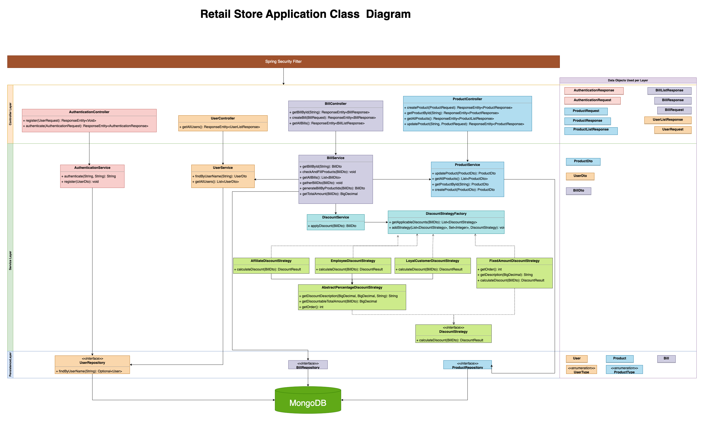

# Retail Store Application
This is a Java/Spring Boot application that provides logic for a Retail Store Discounts. This application is built with the following technologies:

- Maven
- Java 17
- Spring Boot
- Spring Security
- Hibernate JPA
- Docker
- MongoDB
- Unit testing using Mockito
- AOP for logging
- JWT for authentication

---

## Prerequisites

Before running the application, ensure you have the following installed:

- Java 17
- Maven 3.6.3 or later
- MongoDB instance (local or remote)
- Docker

---

## Getting Started

These instructions will get you a copy of the project up and running on your local machine for development and testing purposes.

### Clone

Clone this repository to your local machine using `https://github.com/ahmeric/retail-store`

### Configuration

Update the `application.properties` file located in `src/main/resources` with your MongoDB connection details.

### Build

To build the project, navigate to the root directory of the project in your terminal and run:

```bash
mvn clean install
```

This command will build the project, run the tests, and create an executable JAR file in the target directory.

### Run

To run the application, navigate to the target directory and run:

```bash
java -jar store-1.0.0.jar
```

Or you can use the Spring Boot Maven plugin to run the application:

```bash
mvn spring-boot:run
```
The application will start running at `http://localhost:8080`.

---

### Run with Docker

We provide a Docker Compose file to run the application with MongoDB as a Docker container.

Follow these steps to run the application with Docker Compose:

1. **Navigate to the root directory of the project**.

2. **Build the application** by running the following command:
```bash
mvn clean package
```
3. **Start the application and the MongoDB server** by running the following command:
```bash
docker-compose up
```
This will start the application and MongoDB. The MongoDB instance is pre-populated with some test data for users and products using an init script (`init-mongo.js`).

### Test Data

The initial data consists of several users with different roles and products:

- Users:
    - employeeUser (Employee)
    - affiliateUser (Affiliate)
    - loyalCustomer (Customer for over 2 years)
    - newCustomer (Customer for less than 2 years)

- Products:
    - Product 1 to Product 10 with varying types and prices.

The password for all users is 'password'.

### Accessing the Service

With the application running, you can access the RESTful services at `http://localhost:8080`.

---

## API Documentation

This application uses Swagger for API documentation. After starting the application, navigate to `http://localhost:8080/swagger-ui.html` to view the API documentation.

The JWT token generated upon login needs to be added in the `Authorization` field in Swagger UI (format: `Bearer <token>`).

## API Endpoints

This service exposes the following endpoints:

- **User Registration**

  Endpoint: `POST /register`

  Headers: `Content-Type: application/json`

  Body:

  ```json
  {
    "userName": "<username>",
    "password": "<password>",
    "userType": "<userType>"
  }
  ```

  Response: HTTP status indicating the result of the operation.

- **User Authentication**

  Endpoint: `POST /authenticate`

  Headers: `Content-Type: application/json`

  Body:

  ```json
  {
    "userName": "<username>",
    "password": "<password>"
  }
  ```

  Response: JWT token for authentication.

- **Create a bill**

  Endpoint: `POST /api/v1/bills`

  Headers: `Authorization: Bearer <JWT Token>`, `Content-Type: application/json`

  Body:

  ```json
  {
    "productIdLists": ["<productId1>", "<productId2>", ...]
  }
  ```

  Response: JSON of created bill.

- **Get all bills**

  Endpoint: `GET /api/v1/bills`

  Headers: `Authorization: Bearer <JWT Token>`

  Response: JSON array of all bills.

- **Get a bill by ID**

  Endpoint: `GET /api/v1/bills/{billId}`

  Headers: `Authorization: Bearer <JWT Token>`

  Response: JSON of specific bill details.

- **Create a product**

  Endpoint: `POST /api/v1/products`

  Headers: `Authorization: Bearer <JWT Token>`, `Content-Type: application/json`

  Body:

  ```json
  {
    "name": "<productName>",
    "type": "<productType>",
    "price": "<productPrice>"
  }
  ```

  Response: JSON of created product.

- **Get all products**

  Endpoint: `GET /api/v1/products`

  Headers: `Authorization: Bearer <JWT Token>`

  Response: JSON array of all products.

- **Get a product by ID**

  Endpoint: `GET /api/v1/products/{productId}`

  Headers: `Authorization: Bearer <JWT Token>`

  Response: JSON of specific product details.

- **Update a product**

  Endpoint: `PUT /api/v1/products/{productId}`

  Headers: `Authorization: Bearer <JWT Token>`, `Content-Type: application/json`

  Body:

  ```json
  {
    "name": "<productName>",
    "type": "<productType>",
    "price": "<productPrice>"
  }
  ```

  Response: JSON of updated product.

- **Get all users (Only EMPLOYEE users)**

  Endpoint: `GET /api/v1/users`

  Headers: `Authorization: Bearer <JWT Token>`

  Response: JSON array of all users.

Remember to replace `<username>`, `<password>`, `<JWT Token>`, `<productId1>`, `<productId2>`, `<billId>`, `<productName>`, `<productType>`, `<productPrice>`, and `{productId}` with actual values. The `{productId}` and `{billId}` should be replaced with the `_id` of the product and bill you want to refer to, which can be obtained from the `/products` and `/bills` endpoints respectively. The `<JWT Token>` is the token obtained from the `/authenticate` endpoint.

---

## Unit Tests & Code Coverage

The application includes unit tests written using Mockito. Jacoco is used for generating code coverage reports. To run the tests and generate a coverage report, use the following command:
```bash
mvn clean test jacoco:report
```
The coverage report will be available in `target/site/jacoco/index.html`.

---

## SonarQube Integration

The application is configured with the SonarQube Maven plugin for static code analysis. To run a SonarQube analysis, make sure the SonarQube server is running and then use the following command:

```bash
mvn clean verify sonar:sonar \
  -Dsonar.projectKey=<Your_Project_Key> \
  -Dsonar.projectName='<Your_Project_Name>' \
  -Dsonar.host.url=<Your_SonarQube_Instance_URL> \
  -Dsonar.login=<Your_SonarQube_Token>
```

Replace `<Your_Project_Key>`, `<Your_Project_Name>`, `<Your_SonarQube_Instance_URL>`, and `<Your_SonarQube_Token>` with your specific SonarQube project key, project name, SonarQube instance URL, and token, respectively.

---

## UML Diagram

The following UML diagram shows the key classes in the application:



### ER Diagram


---
